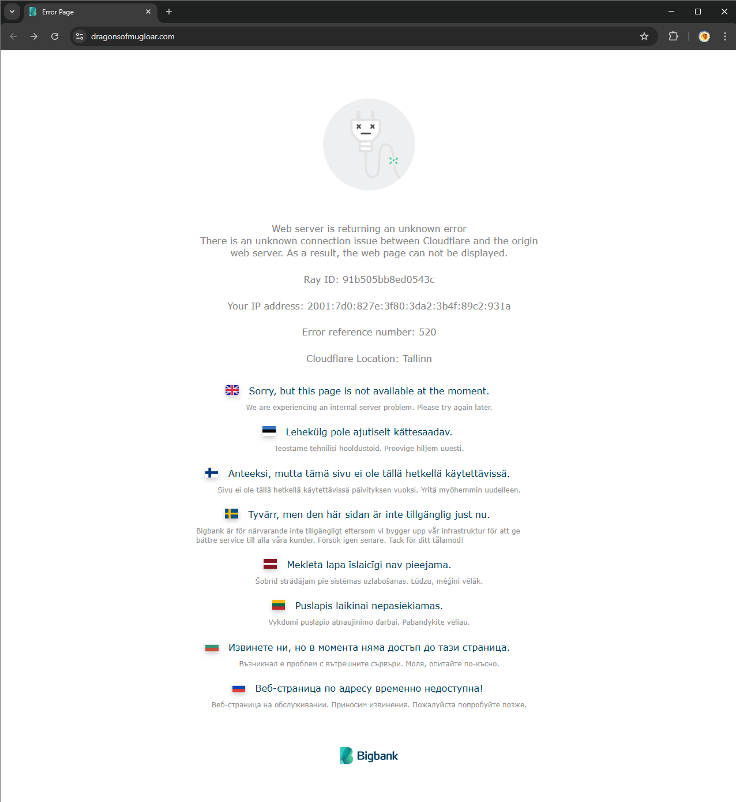

<h2> About </h2>
This program runs an automatic version of the game Dragons of Mugloar.

It starts a new game, collects a list of quests(ads), parses out the best quest to run and attempts to complete it.

If the quest probability chance is below a certain threshold then it instead tries to upgrade your gear.
After that it starts the process all over again until you finally run out of health.

The program is a bit self learning as it keeps track of the quest success statistics which feed back into the
decision making process.

<h2> Running the program </h2>
The game can be run in multiple ways, a few examples are via terminal or from IDE:
<h3> 1) npx ts-node src/dragon.ts</h3>
<h3> 2a) npx tsc </h3>
<h3> 2b) node src/dragon.js </h3>
<h3> 3) Running dragon.ts directly from your IDE </h3>

<h2>Other</h2>
- One other optimization idea I had was to try out logic that prioritizes quests with the highest success rate over best return value but as it already managed to get a decent highscore I decided not to pursue that logic further.
- At the moment the game data is being written to a file instead of being passed on as a variable. 
This was a deliberate decision to make the program feel more like an actual game with a functioning save file. 
Initially I planned to add a feature where you could pause the game and pick it up later via the save file until I found out the game codes time out and expire.
- Regarding the expiration I also discovered a small bug with the game server. When using an expired gameId against any of the API requests it causes the server to temporarily crash and return a 520 error code.

